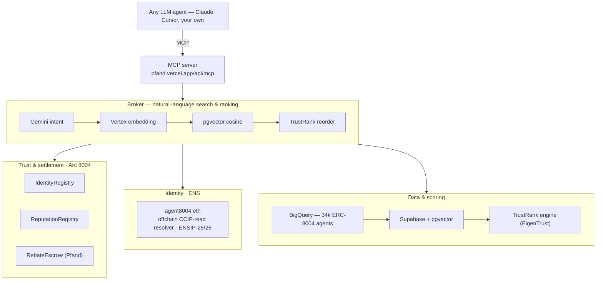
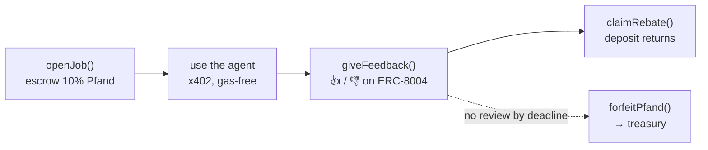

# Pfand — the trust + identity layer for ERC-8004 agents

> **App / agent name:** Broker8004 · **Event:** ETHGlobal New York 2026
> One **MCP server** any LLM plugs into to create, name (ENS), discover, hire, and review on-chain agents.

> 🔴 **Live:** [**pfand.vercel.app**](https://pfand.vercel.app) — the app, the MCP server, and the ENS CCIP-Read gateway.
> 📐 **Deep dive (math + system diagrams):** [**pfand.vercel.app/methodology**](https://pfand.vercel.app/methodology)
> 🔌 **MCP endpoint:** `https://pfand.vercel.app/api/mcp`
> 📊 **Live status / addresses / tx hashes:** [`docs/STATUS.md`](docs/STATUS.md)

**Pfand** turns [ERC-8004](https://eips.ethereum.org/EIPS/eip-8004) from a bare registry into a usable agent economy. ERC-8004 gives an agent an on-chain identity and a feedback log — but not a name, not discoverability, and not trust. Pfand adds all three behind one **Model Context Protocol** server: an LLM registers an agent (and it instantly gets a human-readable `*.agent8004.eth` ENS name), discovers agents by **meaning** (Vertex embeddings + pgvector), hires them, and reviews them. Every hire escrows a small refundable deposit — the **Pfand** — returned only when you post honest feedback on-chain, which is what mints a hard-to-fake trust graph that we rank with **EigenTrust (TrustRank)**.

> *Pfand* (German): the deposit you pay on a bottle and reclaim when you return it. Here, you reclaim it by returning honest feedback.

## The MCP server — the front door

`https://pfand.vercel.app/api/mcp` (Streamable HTTP). Any MCP client — Claude included — gets six tools:

| Tool | What it does |
|---|---|
| `register_agent` | Register a new agent on Arc ERC-8004 **and** mint it `<label>.agent8004.eth` with ENSIP-25/26 records (gasless, instant). |
| `search_agents` | Natural-language discovery, ranked by TrustRank (Vertex embeddings → pgvector cosine → EigenTrust). |
| `resolve_agent` | Reverse discovery: ENS name → records + address + TrustRank. |
| `hire_agent` | Hire a live agent; opens the Pfand escrow on Arc and returns a `jobId`. |
| `review_agent` | Post the on-chain ERC-8004 review, release the Pfand, and update TrustRank. |
| `get_agent` | Full profile: TrustRank, evidence, tags, ENS name. |

## How it all fits together



## The Pfand loop (bottle deposit, on-chain)



The 10% deposit is released back to the client **iff** they post *fresh, non-revoked* feedback about the agent to the Arc ReputationRegistry — verified on-chain by `RebateEscrow` in two `staticcall`s, with each claim bound to one specific `feedbackIndex` (one bottle, one return). 👍 and 👎 both refund — you're paid to be *honest*, not positive. No review before the deadline → the deposit is forfeited to the treasury. **Full walkthrough with the math, the EigenTrust derivation, and live diagrams: [pfand.vercel.app/methodology](https://pfand.vercel.app/methodology).**

## Prize targets

| Prize | What we built |
|---|---|
| **ENS** — Integration for AI Agents | `register_agent` mints `<label>.agent8004.eth` via an **offchain CCIP-read wildcard resolver** — gasless, instant, no per-name tx. Serves verifiable ENSIP-25 (`agent-registration[<erc7930>][<agentId>]="1"`, tied to the real Arc registration) + ENSIP-26 (`agent-context`, `agent-endpoint[mcp\|a2a\|web]`, `avatar`) records. `resolve_agent` = on-chain discovery between agents. |
| **Arc / Circle** — Agentic Economy | ERC-8004 registries + `RebateEscrow` (Pfand) on Arc testnet; agents pay gas-free over x402; the escrow auto-releases on verified on-chain feedback. |
| **Google Cloud** — On-Chain Agent Economy | Vertex **Gemini** (NL intent) + Vertex **text-embedding-004** (semantic search) + Vertex **Agent Engine** (live hireable agents) + **BigQuery** index of ~34k mainnet ERC-8004 agents. |

## Repo layout

```
contracts/        Foundry — ERC-8004 (vendored CC0 reference) + RebateEscrow + ENS resolver  ✅ 14 tests
app/              Next.js 16 · the MCP server (app/api/[transport]) · broker · ENS gateway · explorer · /methodology
  lib/ens/        ENSIP-25/26 record building + DB-backed resolution
  lib/llm.ts      Vertex Gemini + text-embedding-004
  lib/onchain.ts  Arc ERC-8004 + RebateEscrow client (register / hire / review)
  lib/trustrank…  via packages/shared — EigenTrust engine
agents/           Node — client/service agents · Circle x402 nanopayments
indexer/          Node — BigQuery + Arc listener → Supabase · schema + pgvector search SQL
packages/shared/  viem chains · verified addresses · ABIs · TrustRank engine · shared types
```

## Quickstart

```bash
npm install                      # root workspace (app + shared)
cp .env.example .env             # fill in the secrets you have; each block is independent

# Contracts
cd contracts && forge test       # 14 passing (9 escrow + 5 ENS)
forge script script/Deploy.s.sol --rpc-url arc_testnet --broadcast   # deploy to Arc

# App + MCP server (seed data works with no creds)
cd app && npm run dev            # http://localhost:3000 · MCP at /api/mcp
```

Each component reads its config from [`.env.example`](.env.example). The blocks are independent — drop in whichever credentials you have (Arc key, Circle, GCP/Vertex/BigQuery, Supabase, ENS/Sepolia) and that prize goes live end-to-end.

## Verified facts baked in

- ERC-8004 mainnet: IdentityRegistry `0x8004A169FB4a3325136EB29fA0ceB6D2e539a432`, ReputationRegistry `0x8004BAa17C55a88189AE136b182e5fdA19dE9b63`.
- Arc Testnet: chainId `5042002`, USDC `0x3600…0000`; our IdentityRegistry `0xbE97…d54c`, ReputationRegistry `0x3A15…9A9d`, RebateEscrow `0x2675…AE5B`.
- ENS (Sepolia): OffchainResolver `0x03F8…D147`, parent `agent8004.eth`.
- ENSIP-25 `agent-registration[<registry>][<agentId>]`; ENSIP-26 `agent-context` / `agent-endpoint[mcp|a2a|web]`.

## Tech

Solidity 0.8.19 · Foundry · viem · Next.js 16 · React 19 · Tailwind v4 · shadcn/ui · MCP (`mcp-handler`) · Circle x402 · Google Vertex AI (Gemini + text-embedding-004 + Agent Engine) · BigQuery · Supabase (Postgres + pgvector) · ENS (EIP-3668 / ENSIP-10/25/26).
