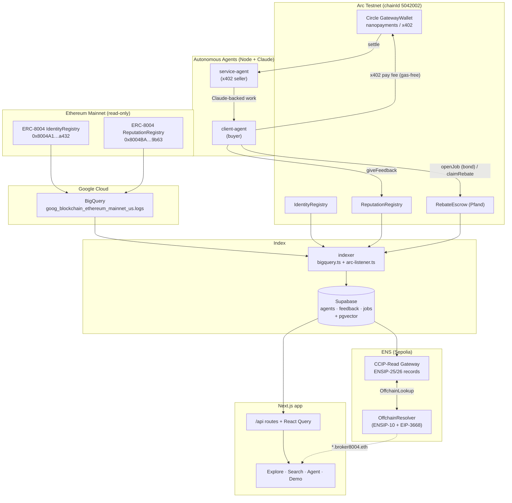
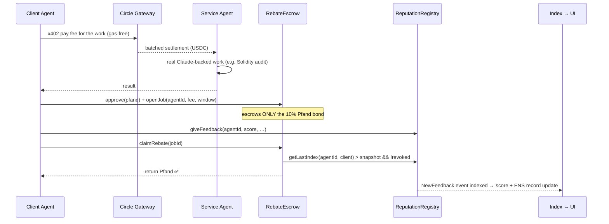

# Pfand — Architecture

Pfand runs across **two chains** that feed **one unified index**, surfaced by **one Next.js app**.
The ERC-8004 `agentId` is the join key tying payments (Arc), analytics (Google/BigQuery), and
naming (ENS) together.

- **Ethereum mainnet** is *read-only*: we index the canonical ERC-8004 registries via BigQuery.
- **Arc Testnet** is *transactional*: our own ERC-8004 registries + `RebateEscrow` run the live
  payment-backed-reputation loop with gas-free Circle nanopayments.
- **Supabase (Postgres + pgvector)** is the single index powering the API, NL search, and the ENS
  CCIP-Read gateway.

## System diagram



## The Pfand loop (sequence)



If the client never posts feedback before the deadline, `forfeitPfand` sends the deposit to the
treasury. Feedback is therefore economically costly to skip and cryptographically tied to a real
payment — the property that makes this index harder to fake than scraped feedback events.

## Why each prize is satisfied

| Prize | Component | Evidence |
|---|---|---|
| **Google Cloud** | `indexer/` (BigQuery) + `app/` explorer | Queries the exact mainnet registries (`0x8004…`) from `goog_blockchain_ethereum_mainnet_us.logs`; reputation scores, trends, activity heatmaps, x402 flags, NL search. |
| **Arc / Circle** | `agents/` + `contracts/RebateEscrow.sol` | Agents pay each other gas-free via `@circle-fin/x402-batching` on Arc; `RebateEscrow` is conditional escrow with automatic on-chain-verified release. |
| **ENS** | `gateway/` + `contracts/src/ens/` | Offchain CCIP-Read resolver serving live ENSIP-25 (`agent-registration`) + ENSIP-26 (`agent-context`, `agent-endpoint`) records from the index — non-cosmetic, no hard-coded values. |

## Repository layout

```
contracts/   Foundry — ERC-8004 (vendored) + RebateEscrow + ENS OffchainResolver  (14 tests)
agents/      Node — client/service agents, Circle x402 nanopayments, Claude work
indexer/     Node — BigQuery + Arc listener → Supabase; schema + hybrid-search SQL
gateway/     Node — ENS CCIP-Read gateway (ENSIP-25/26)
app/         Next.js 16 + shadcn + React Query — explorer, search, agent, demo
packages/shared/  viem chains, addresses, ABIs, shared domain types
```
