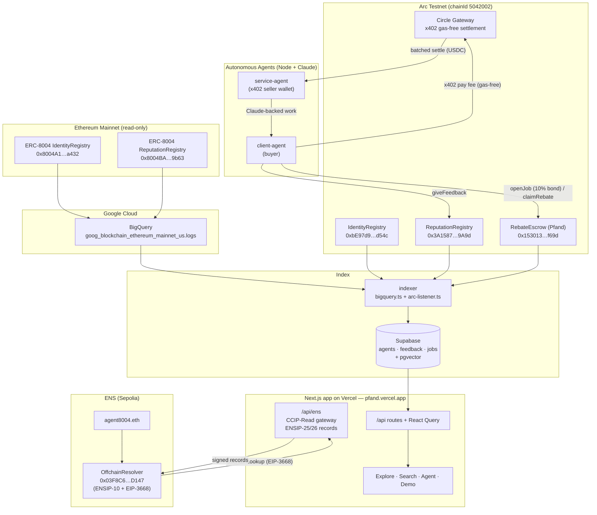
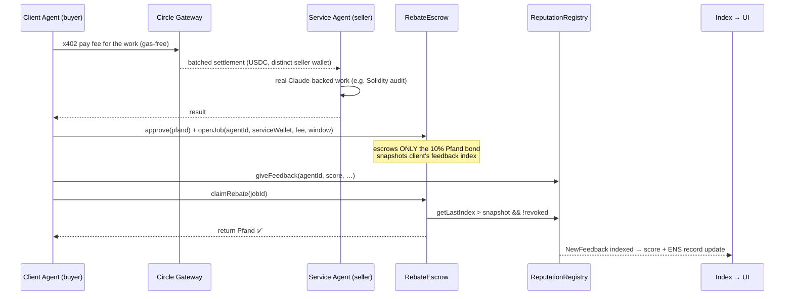

# Pfand — Architecture

Pfand runs across **two chains** that feed **one unified index**, surfaced by **one Next.js app**.
The ERC-8004 `agentId` is the join key tying payments (Arc), analytics (Google/BigQuery), and
naming (ENS) together.

- **Ethereum mainnet** is *read-only*: we index the canonical ERC-8004 registries via BigQuery.
- **Arc Testnet** is *transactional*: our own ERC-8004 registries + `RebateEscrow` run the live
  payment-backed-reputation loop, with the service fee paid **gas-free** over Circle x402.
- **Supabase (Postgres + pgvector)** is the single index powering the API and NL search.
- **The Next.js app on Vercel** serves both the frontend *and* the ENS CCIP-Read gateway at
  `/api/ens` — the standalone gateway was ported into the app, and the Sepolia `OffchainResolver`
  points its CCIP-Read URL at the deployed app.

## Live deployments

Everything below is deployed and live.

| What | Where | Address / URL |
|---|---|---|
| App + ENS gateway | Vercel | https://pfand.vercel.app (`/api/ens`) |
| `RebateEscrow` (Pfand) | Arc 5042002 | `0x153013f66b27De74D7b5718eb44Cd273E0FCf69d` |
| IdentityRegistry | Arc 5042002 | `0xbE97d9fA39Fa62FC4d8165D1F3d6D8ef6eEDd54c` |
| ReputationRegistry | Arc 5042002 | `0x3A158775BB1D1F5f823712327fBBD3d977FA9A9d` |
| ValidationRegistry | Arc 5042002 | `0xC4AD2C3FD6356f16d27f256089451B2599951f24` |
| OffchainResolver | Sepolia | `0x03F8C6EF49Ca2945a653F5B62F47EB65A8A2D147` |
| ENS name | Sepolia | `agent8004.eth` (owner `0x2D97E75CA697007Fc7168571951314f19Cc0631b`) |
| ERC-8004 Identity (indexed) | Ethereum mainnet | `0x8004A169FB4a3325136EB29fA0ceB6D2e539a432` |
| ERC-8004 Reputation (indexed) | Ethereum mainnet | `0x8004BAa17C55a88189AE136b182e5fdA19dE9b63` |
| Mainnet dataset | BigQuery | `bigquery-public-data.goog_blockchain_ethereum_mainnet_us.logs` |

- Arc explorer: `testnet.arcscan.app`. Circle x402 runs gas-free on Arc Testnet with **no API key**
  (Gateway deposit + a distinct seller wallet are all that's required — a buyer/seller must differ
  or the Gateway rejects the payment as a self-transfer).
- Contracts ship with **13 Foundry tests** (8 for `RebateEscrow`, 5 for the ENS `OffchainResolver`).

## System diagram



The resolver for `agent8004.eth` on Sepolia carries a CCIP-Read `url` pointing at
`https://pfand.vercel.app/api/ens/{sender}/{data}.json`. Any ENS client resolving
`<agent>.agent8004.eth` is redirected (via `OffchainLookup`) to the hosted gateway, which serves
signed ENSIP-25 (`agent-registration`) + ENSIP-26 (`agent-context`, `agent-endpoint`) records for
real mainnet ERC-8004 agents.

## The Pfand loop (sequence)

The escrow is **bond-only**. The service fee is paid out-of-band, gas-free, over Circle x402 — the
escrow never touches it. The escrow holds **only the 10% Pfand bond**, returned only if the client
posts *fresh*, non-revoked ERC-8004 feedback (verified on-chain). There is no `completeJob` step.



If the client never posts fresh feedback before the deadline, anyone can call `forfeitPfand`, which
sends the bond to the treasury. Feedback is therefore economically costly to skip and
cryptographically tied to a real payment — the property that makes this index harder to fake than
scraped feedback events.

## Why each prize is satisfied

| Prize | Component | Evidence |
|---|---|---|
| **Google Cloud** | `indexer/` (BigQuery) + `app/` explorer | Queries the exact mainnet registries (`0x8004…`) from `goog_blockchain_ethereum_mainnet_us.logs`; reputation scores, trends, activity heatmaps, x402 flags, NL search. |
| **Arc / Circle** | `agents/` + `contracts/RebateEscrow.sol` | Agents pay each other gas-free via Circle x402 on Arc (Gateway deposit + distinct seller wallet, no API key); `RebateEscrow` is a bond-only conditional escrow with on-chain-verified release. |
| **ENS** | `app/app/api/ens` + `app/lib/ens` + `contracts/src/ens/` | Offchain CCIP-Read resolver (live on Sepolia as `agent8004.eth`) serving signed ENSIP-25/26 records from the hosted Next app gateway — non-cosmetic, no hard-coded values. |

## Repository layout

```
contracts/   Foundry — ERC-8004 (vendored) + RebateEscrow + ENS OffchainResolver  (13 tests)
agents/      Node — client/service agents, Circle x402 gas-free payments, Claude work
indexer/     Node — BigQuery + Arc listener → Supabase; schema + hybrid-search SQL
gateway/     Node — original standalone ENS CCIP-Read gateway (ported into the app)
app/         Next.js 16 on Vercel — explorer/search/agent/demo + /api/ens CCIP-Read gateway
packages/shared/  viem chains, addresses, ABIs, shared domain types
```
