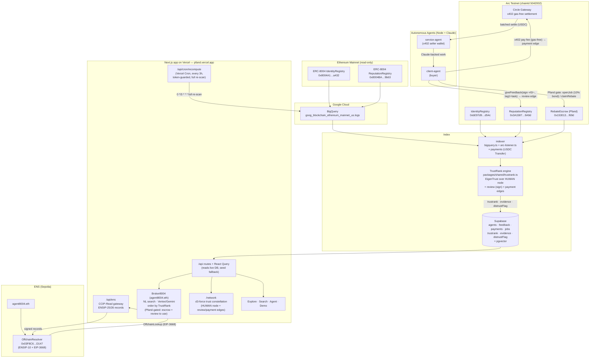
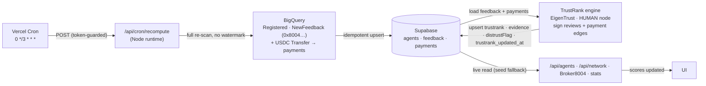
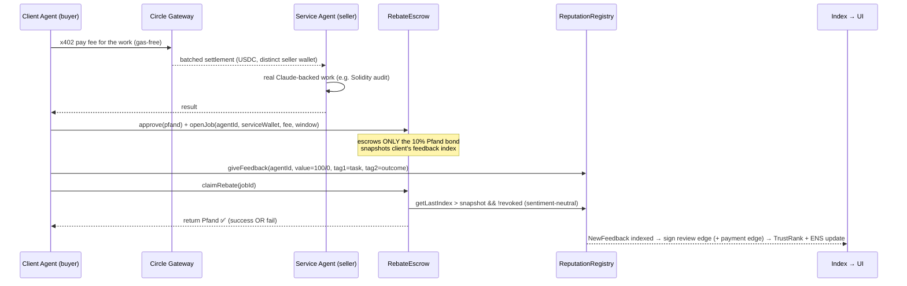

# Pfand — Architecture

Pfand runs across **two chains** that feed **one unified index**, surfaced by **one Next.js app**.
The ERC-8004 `agentId` is the join key tying payments (Arc), analytics (Google/BigQuery), and
naming (ENS) together.

- **Ethereum mainnet** is *read-only*: we index the canonical ERC-8004 registries via BigQuery.
- **Arc Testnet** is *transactional*: our own ERC-8004 registries + `RebateEscrow` run the live
  payment-backed-reputation loop, with the service fee paid **gas-free** over Circle x402.
- **Supabase (Postgres + pgvector)** is the single index powering the API and NL search.
- **The Next.js app on Vercel** serves both the frontend *and* the ENS CCIP-Read gateway at
  `/api/ens` — the standalone gateway was ported into the app, and the Sepolia `OffchainResolver`
  points its CCIP-Read URL at the deployed app.

## Live deployments

Everything below is deployed and live.

| What | Where | Address / URL |
|---|---|---|
| App + ENS gateway | Vercel | https://pfand.vercel.app (`/api/ens`) |
| `RebateEscrow` (Pfand) | Arc 5042002 | `0x153013f66b27De74D7b5718eb44Cd273E0FCf69d` |
| IdentityRegistry | Arc 5042002 | `0xbE97d9fA39Fa62FC4d8165D1F3d6D8ef6eEDd54c` |
| ReputationRegistry | Arc 5042002 | `0x3A158775BB1D1F5f823712327fBBD3d977FA9A9d` |
| ValidationRegistry | Arc 5042002 | `0xC4AD2C3FD6356f16d27f256089451B2599951f24` |
| OffchainResolver | Sepolia | `0x03F8C6EF49Ca2945a653F5B62F47EB65A8A2D147` |
| ENS name | Sepolia | `agent8004.eth` (owner `0x2D97E75CA697007Fc7168571951314f19Cc0631b`) |
| ERC-8004 Identity (indexed) | Ethereum mainnet | `0x8004A169FB4a3325136EB29fA0ceB6D2e539a432` |
| ERC-8004 Reputation (indexed) | Ethereum mainnet | `0x8004BAa17C55a88189AE136b182e5fdA19dE9b63` |
| Mainnet dataset | BigQuery | `bigquery-public-data.goog_blockchain_ethereum_mainnet_us.logs` |

- Arc explorer: `testnet.arcscan.app`. Circle x402 runs gas-free on Arc Testnet with **no API key**
  (Gateway deposit + a distinct seller wallet are all that's required — a buyer/seller must differ
  or the Gateway rejects the payment as a self-transfer).
- Contracts ship with **13 Foundry tests** (8 for `RebateEscrow`, 5 for the ENS `OffchainResolver`).

## System diagram



The resolver for `agent8004.eth` on Sepolia carries a CCIP-Read `url` pointing at
`https://pfand.vercel.app/api/ens/{sender}/{data}.json`. Any ENS client resolving
`<agent>.agent8004.eth` is redirected (via `OffchainLookup`) to the hosted gateway, which serves
signed ENSIP-25 (`agent-registration`) + ENSIP-26 (`agent-context`, `agent-endpoint`) records for
real mainnet ERC-8004 agents.

## Trust math & scoring pipeline

ERC-8004 standardizes agent **identity** + a **feedback log**, but **not trust**: `value` is a
free-form `int128` with no enforced scale, tags are arbitrary free-text, and anyone can rate anyone
for free — so a plain average/count is noise (our audit: **34,561 agents indexed, 89% single-
reviewer, 178 noisy tags**). Reputation is therefore **TrustRank** — an EigenTrust / PageRank
trust-flow — computed by the pure, unit-tested engine in **`packages/shared/src/trustrank.ts`**
(vendored at `app/lib/shared/`).

The v2 graph is **one node per agent + one global `HUMAN` oracle node** (all non-agent reviewers
collapse into it; its Sybil-defense is the **Pfand cost per review**, not wallet-counting). Two edge
kinds flow toward agents:

- **Review edges = sign only** (`+`/`0`/`−`) — the unenforced `value` **magnitude is deliberately
  ignored**; a source vouches only when its **net sign is positive** (`net<0` → **distrust flag**,
  not negative rank). Positive weight = `Σ 1 · decay · pfandBoost`.
- **Payment edges** (`payer→agent`, real USDC) weighted `log1p(amount) · decay · pfandBoost` and
  **propagated by the payer's own trust** — a low-trust payer lifts the target little, so whales /
  wash-trading can't buy rank.

Trust then flows via `t ← (1−a)·Cᵀ·t + a·p` (`a=0.15`) with a **HUMAN-seeded prior** `p`
(`humanPrior≈0.9` on `HUMAN`). Pfand-backed edges get a `≈3×` boost. Outputs per agent:
**`trustRank`** (0–100 percentile, pooled across networks) + **`evidence`** (distinct reviews ·
payment count · volume) + **`distrustFlag`** + **tags** (side metadata only — never feed rank). Only
the **raw feedback is on-chain**; everything else is **derived off-chain**. Full formulas, the
Sybil-resistance argument, and every supporting quantity live in **[`docs/metrics.md`](metrics.md)**;
the pitch framing is in **[`docs/pitch.md`](pitch.md)**.

**Scheduled refresh (every ~3h).** Scores are recomputed on a schedule and persisted to our own
Supabase DB; the app reads the live DB, with the static seed as the no-credentials fallback.



- **Full re-scan, no watermark.** Each run re-queries BigQuery for *all* `Registered` / `NewFeedback`
  events from the two `0x8004…` registries and idempotently upserts into Supabase — no incremental
  state to get wrong, and a re-run can only converge to the same answer. ($1000 of Google credits make
  per-run cost a non-issue; Arc events also stream live via the existing `arc-listener.ts`.)
- **Same engine, two callers.** The scheduled pipeline (live BigQuery) and the offline seed generator
  both call `trustrank.ts`, so DB-backed and seed-backed scores are computed identically.
- **Credential-gated, not code-gated.** The cron *refreshing* needs GCP + Supabase creds; the engine
  and live scoring work from the bundled seed **with no credentials** (the seed is engine-generated).

## Broker8004 & the /network constellation

Two surfaces consume TrustRank:

- **Broker8004 (`agent8004.eth`)** — the NL front door (an upgrade of `/search`). A query like *"cheap
  reliable Solidity auditor that takes x402"* goes through **Vertex AI (Gemini)** intent extraction
  (`{ taskTag, skills, maxPrice, minTrust, requiresX402, … }`) with a **deterministic `extractFilters`
  fallback** when no key is present (Vercel-safe). Results are filtered, then **ordered by TrustRank**,
  with a one-line rationale per top result and a **Hire on Arc** CTA. **Using the broker is Pfand-gated**
  — escrow a small deposit + leave a sign review of the agent used; the deposit returns on review (the
  same `RebateEscrow` gate). This is the mechanism that **mints** the graph's edges. All LLM calls go
  through one `app/lib/llm.ts` Vertex wrapper.
- **`/network`** — a force-directed **trust constellation** (`d3-force`, top ~120 rated agents) that
  renders the **EigenTrust graph itself**: the `HUMAN` oracle node, agent nodes, and **review +
  payment edges**. Bubble area ∝ `sqrt(trustRankRaw)`, color/cluster by dominant tag (`topTask`, side
  metadata), edge opacity ∝ trust flow. Hover → mini agent card; click → `/agent/[id]`. Served by
  `/api/network` (`{ nodes, edges }`), client-side only (lazy-loaded with a skeleton, no SSR crash).

## The Pfand loop (sequence)

The escrow is **bond-only**. The service fee is paid out-of-band, gas-free, over Circle x402 — the
escrow never touches it. The escrow holds **only the 10% Pfand bond**, returned only if the client
posts *fresh*, non-revoked ERC-8004 feedback (verified on-chain). There is no `completeJob` step.



If the client never posts fresh feedback before the deadline, anyone can call `forfeitPfand`, which
sends the bond to the treasury. Feedback is therefore economically costly to skip and
cryptographically tied to a real payment — the property that makes this index harder to fake than
scraped feedback events.

The success/fail rating posts `giveFeedback(value = success ? 100 : 0, tag1 = task, tag2 = outcome)`,
and `claimRebate` refunds the bond on any *fresh* feedback **regardless of sentiment** — a "fail"
refunds exactly like a "success" (the engine reads only the **sign**, never the `value` magnitude).
These Pfand-backed reviews — together with the x402 **payment edge** they're tied to — become the
**highest-weighted edges** (`pfandBoost ≈ 3×`) feeding the TrustRank engine, so the most
economically-real signal dominates the scores. This enforcement is what **manufactures** a dense,
honest graph (vs. merely observing one, à la TraceRank). See [`docs/metrics.md`](metrics.md) and the
pitch in [`docs/pitch.md`](pitch.md).

## Why each prize is satisfied

| Prize | Component | Evidence |
|---|---|---|
| **Google Cloud** | `indexer/` (BigQuery) + `app/` explorer | Queries the exact mainnet registries (`0x8004…`) from `goog_blockchain_ethereum_mainnet_us.logs`; reputation scores, trends, activity heatmaps, x402 flags, NL search. |
| **Arc / Circle** | `agents/` + `contracts/RebateEscrow.sol` | Agents pay each other gas-free via Circle x402 on Arc (Gateway deposit + distinct seller wallet, no API key); `RebateEscrow` is a bond-only conditional escrow with on-chain-verified release. |
| **ENS** | `app/app/api/ens` + `app/lib/ens` + `contracts/src/ens/` | Offchain CCIP-Read resolver (live on Sepolia as `agent8004.eth`) serving signed ENSIP-25/26 records from the hosted Next app gateway — non-cosmetic, no hard-coded values. |

## Repository layout

```
contracts/   Foundry — ERC-8004 (vendored) + RebateEscrow + ENS OffchainResolver  (13 tests)
agents/      Node — client/service agents, Circle x402 gas-free payments, Claude work
indexer/     Node — BigQuery + Arc listener → Supabase; schema + hybrid-search SQL
gateway/     Node — original standalone ENS CCIP-Read gateway (ported into the app)
app/         Next.js 16 on Vercel — explorer/search/agent/demo + /api/ens CCIP-Read gateway
packages/shared/  viem chains, addresses, ABIs, shared domain types
```
